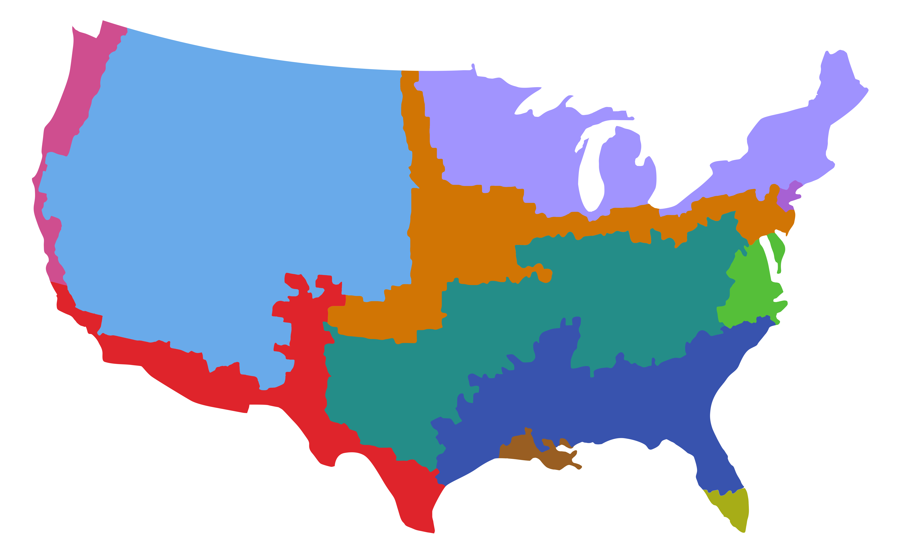
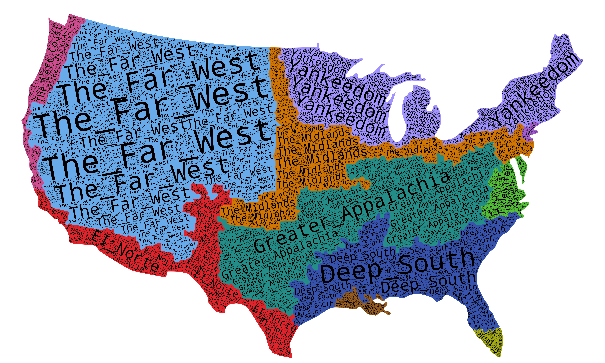
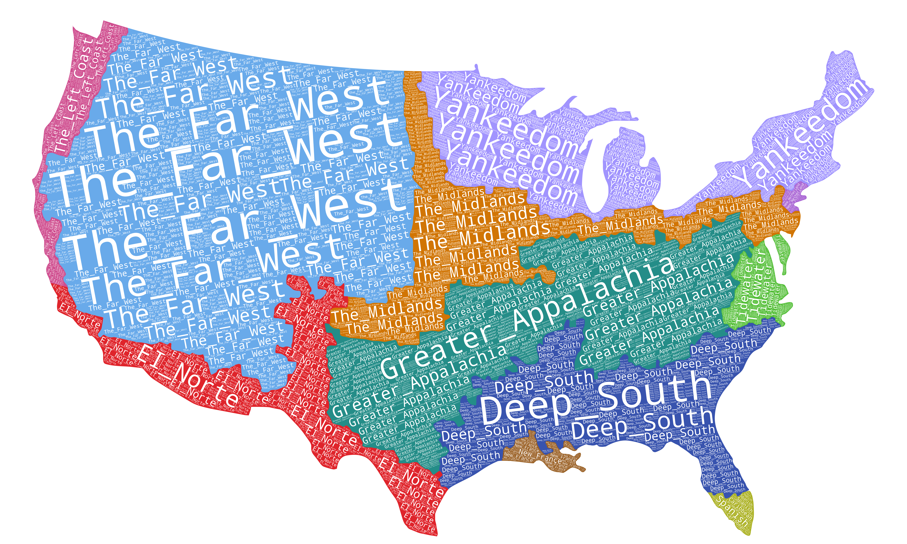

# Text-Color-Hybrid-Labeling-for-Multiclass-Map-Visualization

This repository contains the datasets, figures, and source code for the paper
**“Text-Color-Hybrid Labeling for Multiclass Map Visualization”**,
presented at [The 18th International Symposium on Visual Information Communication and Interaction (VINCI 2025)](https://vinci2025.games.cg.jku.at/).

## Citation

If this work contributes to your research or is reused in other projects, we would appreciate a citation:

> Xinyao Chen, Xinyuan Zhang, Teng Ma, Lingyun Yu, and Yu Liu. 2025.
> *Text-Color Hybrid Labeling for Multiclass Map Visualization: A Comparative Evaluation of Four Annotation Strategies*.
> In **Proceedings of the 18th International Symposium on Visual Information Communication and Interaction (VINCI ’25)**.
> Association for Computing Machinery, New York, NY, USA, Article 14, 1–8.
> https://doi.org/10.1145/3769534.3769610

---

## Implementation

Our method takes **`M7_NoLegend.png`** as input and generates word-cloud enhanced maps, including
**`Output__M7_NoLegend_black.png`** and **`Output__M7_NoLegend_white.png`**.

### Input



### Outputs (generated by our method)

#### Black word clouds



#### White word clouds



---

## 📂 Repository Structure

- **Figures/**Contains generated images used in the experiments and examples.
  - `M7_NoLegend.png`: Original input map without legend
  - `Output__M7_NoLegend_black.png`: Map with black word clouds
  - `Output__M7_NoLegend_white.png`: Map with white word clouds
  - `Output__M7_NoLegend_colored.png`: Map with colored word clouds


- **sample.ipynb**Example notebook demonstrating how to run the labeling pipeline on sample data.
- **README.md**
  Documentation of the repository.

---

## ⚙️ Code Overview

The source code implements a pipeline for hybrid text–color labeling on multiclass maps:

1. **Image Processing**Detect target regions based on color segmentation.
2. **Rotation Angle Estimation**Apply PCA to compute dominant orientation for text placement.
3. **Word Cloud Generation**Place class labels as rotated word clouds inside each region.
   - Supports *colored*, *black*, and *white* variants.
4. **Output Composition**
   Combine generated word clouds with the base map.

Main functions and classes:

- `ImageProcessor`: load and preprocess images, detect color areas.
- `RotationAngleCalculator`: compute optimal label rotation using PCA.
- `WordCloudGenerator`: create word clouds for different styles (colored, black, white).
- `generate_rotated_wordclouds`: end-to-end function to generate labeled maps.

---

## 🚀 Usage

Example code snippet:

```python
image_path = 'M7_NoLegend.png'
color_text_pairs = {
    (223, 36, 43): 'EI_Norte',
    (56, 83, 174): 'Deep_South',
    (36,141,136): 'Greater_Appalachia',
    (153,94,34): 'New_France',
    (167,97,211): 'New_Netherland',
    (167,173,23): 'Spanish_Caribbean',
    (105,170,234): 'The_Far_West',
    (207,78,143): 'The_Left_Coast',
    (209,117,4): 'The_Midlands',
    (85,191,57): 'Tidewater',
    (161,148,254): 'Yankeedom'
}

generate_rotated_wordclouds(image_path, color_text_pairs)
```
